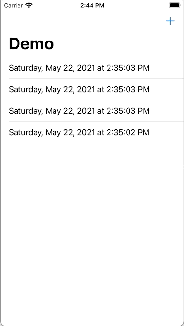

# Database Facade
This app is a rework of the default CoreData project in Xcode 12.  Instead of using `@FetchResult` and tightly coupling the database to the view, CoreData is facaded behind a `PeristenceServiceProtocol`, allowing:
  * Removal of business logic from the view, by placing it in the view model instead
  * Decoupling the database service from the rest of the app
  * Mocking of previews
  * Testability

